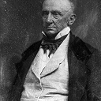
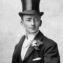
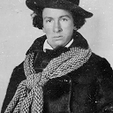
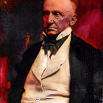
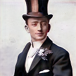
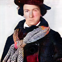

# GANBan

[](https://github.com/github/gh-actions-importer/actions/workflows/ci.yml)

Correcting and coloring old and damaged images using a CycleGAN

| | | | |
| :----------- | :------: | ------------: | --- |
|  |  |  |  |
|  |  |  |  |

## Converting Images
```sh
python convert.py input_file
```

This will fix a damaged image and and will colorize grayscale images.

This requires the weights `ganban.pth` to be in the same directory. This can be downloaded from [here](https://0x0.st/Hj3_.zip).

Additional arguments are as follows:

```
usage: convert.py [-h] [-i] [-m] [-r] input_file [input_file ...]

Converts an old damaged image into a new colored image. Outputs a file(s) with the name input_file.<step>.png

positional arguments:
  input_file          input file(s)

options:
  -h, --help          show this help message and exit
  -i, --intermediate  Output (save) the intermediate states
  -m, --multi-domain  Use the multiple domain/model approach (damaged<>fixed<>color)
  -r, --reverse       Reverses the process (corrected image --> old image)
```

## Dataset

You can download the dataset used [here](https://0x0.st/Hj39.zip). It contains ~900 unique images trained on for 3 different models.

## Structure

### data 

Dataset location and directory to save models in.

### config.py

Contains the hyperparameters.

### cyclegan.py

Contains the generator, discriminator, and initialization weights.

### datasetup.py

Contains the class (Dataset) that interacts with the data

### engine.py

Setup for the train and test steps

### train.py

Entry point to begin training the model. To start, execute `python train.py`.
